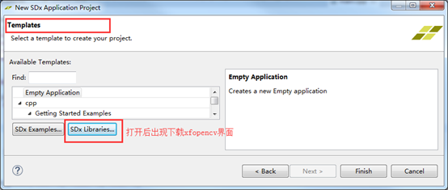
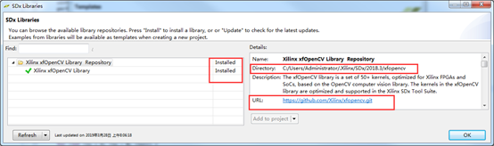
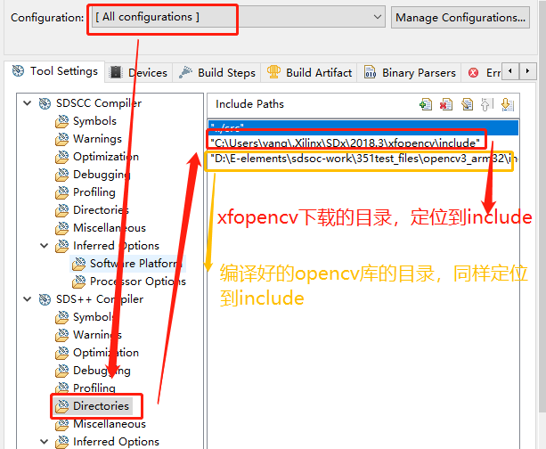
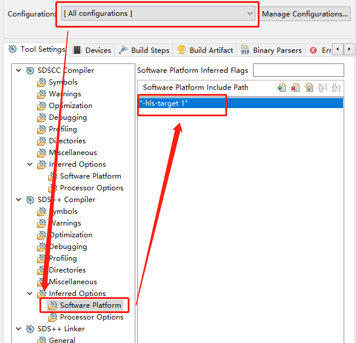
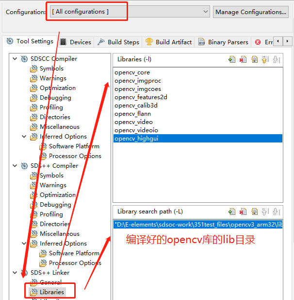

# 基于SDSoC的图像处理教程

## 一概述

使用板卡:EE351

开发工具：Vivado/SDSoc

开发语言：C++

## 二配置工作

新建一个自定义platform，后期补充创建方法。

新建一个应用，首次使用时下载安装xfopencv





创建完工程后，右键application 名称->properties，具体配置应如下图所示：







```
"D:\E-elements\sdsoc-work\351test_files\opencv3_arm32\include"
"C:\Users\yang\.Xilinx\SDx\2018.3\xfopencv\include"
"-hls-target 1"
opencv_core
opencv_imgproc
opencv_imgcoes
opencv_features2d
opencv_calib3d
opencv_flann
opencv_video
opencv_videoio
opencv_highgui
"D:\E-elements\sdsoc-work\351test_files\opencv3_arm32\lib"
```

点击“Apply and close”保存关闭

## 三具体实验

01图像显示

02图像的几何变换

03灰度变换

04二值化和阈值处理

05直方图匹配变换

06中值滤波

07均值滤波

08图像理想低通滤波

09图像横纵双向一次微分运算

10梯度二值化图像

11Robert算子边缘检测

12sobel算子边缘检测

13prewitt算子边缘检测

14图像半阈值分割

15图像的轮廓提取

16图像全向腐蚀

17图像全向膨胀

18图像开启

19图像闭合

20图像粗化

21图像细化

22subtopic

23亮度调节

24对比度调节

25马赛克效果处理

26线性平滑滤波

27锐化处理-双向增强

28梯度锐化

29浮雕处理

30霓虹处理


